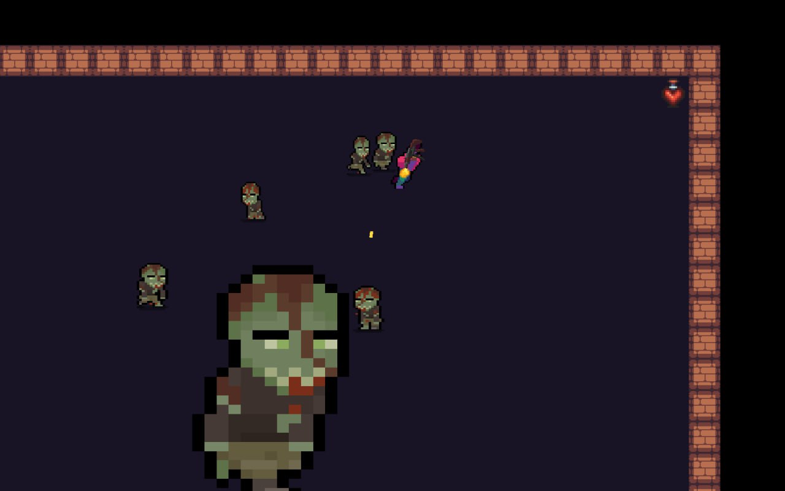
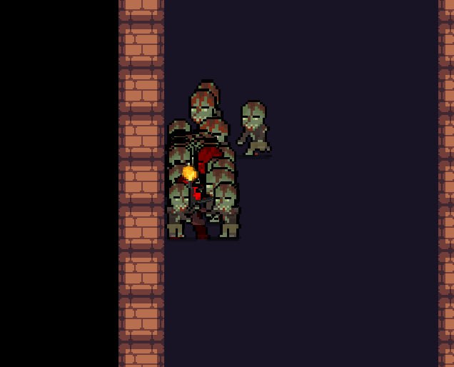

# TikTime

**TikTime** is a 2D roguelike game featuring a tile-based world and dynamic combat. Levels are randomly selected from a predefined pool. Built using the MVC architecture and key design patterns (Factory, Singleton), and developed with libGDX.

---

## 🚀 Installation

You can download the latest release (v1.0) from GitHub:

* **Release page**: [TikTime v1.0](https://github.com/Artemyogo/TikTime/releases/tag/v1.0)
* **Direct download**: [TikTIme-1.0.0.zip](https://github.com/user-attachments/files/20734705/TikTIme-1.0.0.zip)

After downloading, unzip the archive and run the JAR file:

```bash
java -jar TikTime-1.0.0.jar
```

---

## 📂 Project Repository

Explore the source code and contribute:

[GitHub: Artemyogo/TikTime](https://github.com/Artemyogo/TikTime)

---

## 🛠️ Technologies

* **Framework:** libGDX
* **Architecture:** MVC
* **Key Patterns:** Factory, Singleton
* **Language:** Java
* **Build Tool:** Gradle

---

## 🎯 Gameplay

* Randomly selected levels from a predefined pool
* Tile-based world with procedurally generated layouts
* Dynamic combat mechanics

Enjoy your adventures in the roguelike world of TikTime! 🎲

---

## 🖼️ Gameplay Examples





